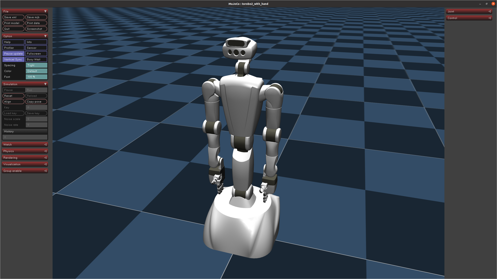
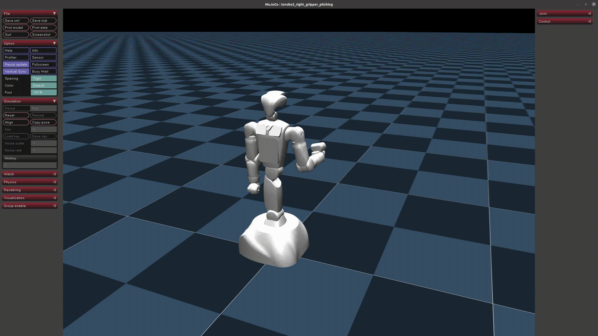

# torobo_mujoco

## Install MuJoCo
Python 3.8 or higher is required.

For more information, please refer to https://github.com/google-deepmind/mujoco .

```
pip install mujoco
```

## Example

1. Clone this repository and move to torobo_mujoco/example.
    ```
    git clone https://github.com/TokyoRobotics/torobo_mujoco.git
    ```

    ```
    cd torobo_mujoco/example
    ```

2. Execute the example scripts.

    ### Spawn model

    ```
    python example_torobo2.py
    ```
    

    ### Pitching motion

    ```
    python example_torobo2_pitching.py
    ```
    

